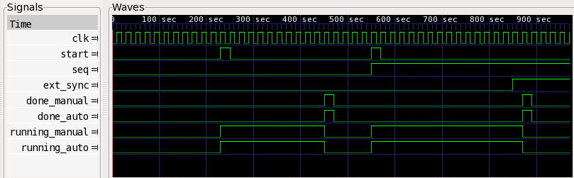

Simple Example
==============

Suppose you need a state machine that issues a one-shot trigger that
is a delayed version of a received one-shot trigger. Under one
scenario you want to wait a fixed 10 clock cycles before issuing the
one-shot trigger and under the scenario you wait for an external
synchronization signal to go high.

If you were to write this as Verilog, it would look something like this:

.. literalinclude:: ../../examples/example1/example1_manual.v
   :language: c
   :linenos:

To generate the same exact behavior using ``seq``, you would instead
create a python source file as follows:

.. literalinclude:: ../../examples/example1/example1.py
   :language: python
   :linenos:

If you named this script ``example1.py``, then from the command line
you can run the following command to generate the verilog::

    python example1.py

Upon completion, you will have an auto-generated verilog file called
``exmple1.v``. If you take a peek at this file, it will not look
anything like the manually coded one above. The exact look of the
file, in fact, may change from version to version of ``seq`` as
changes are made to add features or improve efficiency.

Wrapping the manually and automatically generated verilog modules up
in a common testbench, we can see that they both behave the same. The
screen dump below from ``gtkwave`` shows that indeed they do. The
``clk``, ``start``, ``seq``, and ``ext_sync`` signals are fed to both
modules identically. The ``done_manual`` and ``running_manual``
signals are generated by the manual implementation and the
``done_auto`` and ``running_auto`` are generated by the automatically
generated code. This shows that they both behave identically.

Now let's explain how the works line-by-line. In Lines 1-2, we import
the python modules that we need. The ``Bin`` and ``Sequence`` modules
contain implementation of many different classes that implement
different types of ``Bins`` and ``Sequences``.

On line 4 we create a seq.Signal with a name ``ext_sync`` and having
a width of 1 bit. This signal will later be referenced when we create
the Sync Sequence. The ``Bin`` and Sync ``Sequence`` will conspire
together to figure out that this signal is not defined anywhere else
and so it will make it an input. Thus, when the verilog is generated,
there will be an input port called ``ext_sync`` that has a width of 1
and the user will need to wire up a driver to that input when
instantiating this module.

On line 6 we start the instantiation of ``Bin``. We use a ``Bin``
called Bin in the Bin module (``Bin.Bin``). As of the writing of this
writing there is only one other type of ``Bin``, and it is called a
``Bin.Len1Bin``. That is a very specialized ``Bin`` that is optimized
for speed when all ``Sequences`` are simple length 1. See the module
documentation for more information on it. Otherwise, you will usually
use the ``Bin.Bin`` class for building your ``Bins``.

On line 7 we give the ``Bin`` a name of ``example1``. This is the name
of both the module and the file that gets generated. You can also use
reference ``Bins`` by their name when embedding ``Bins`` in other
``Bins``. For these reasons the name cannot be a verilog keyword and
must obey verilog naming conventions (such as not containing spaces,
non alpha-numeric charagers, etc.).

One line 8 we begin the definition of the member ``Sequences`` of this
``Bin``.  The member ``Sequencers`` are passed in as a list where the
order corresponds to the sequence address as controlled via the
``seq`` input port that gets created. 

On line 9 will implement ``Sequence`` with address 0x0. It is a
Stall ``Sequence``. We give this ``Sequence`` a hard-coded ``count``
argument of ``10``. This means that this ``Sequence`` will count to
``10`` whenever it is addressed and given the ``start`` signal. After
counting to ``10`` it will drop its ``running`` signal and issue a
one-shot ``done`` pulse. To make things more interesting, this Stall
``Sequencer`` could have also taken a Signal for the ``count`` argument
to give it a parameterized stall point. For example::

    Sequence.Stall(count=seq.Signal(name='my_stall_count', width=8))

In this example, the generated module would then have an input of
width 8 bits called ``my_stall_count`` that would need driven. Thus we
just created a Stall ``Sequence`` with a programmable stall count up
to 256 counts.

On Line 10 we implement a Sync ``Sequence`` that takes on address 0x1.
When the Sync ``Sequence`` executes, it will hold ``running`` high until
the ``sync`` signal goes high. At that point it will drop ``running`` and
issue an one-shot ``done`` pulse. The Sync ``Sequence`` takes additional
optional arguments. One of the most useful is the ``active_high``. When
``active_high`` is set to ``False``, then the Sync module waits for the
``sync`` Signal to go low before returning. For example::

   Sequence.Sync(sync=ext_sync, active_high=False)

Finally, on line 14, we call the member function ``vlog_dump()`` that
actually generates the verilog that implements the desired specification.

The generated verilog has the following ports::

    module example1(
      input clk,
      input reset_n,
      input ext_sync,
      input seq,
      input start,
      output running,
      output done);
    ...

To use this code, you

* Hook up the ``clk`` and ``reset_n`` as normal.
* Create an external synchronization signal and hook it up to the
  ``ext_sync`` port. When you set the ``seq`` input high and strobe
  the ``start`` port, then the Sync ``Sequencer`` is activated and
  will wait for ``ext_sync`` to go high before dropping ``running``
  and strobing the ``done`` one-shot.
* The ``seq`` port is the ``Sequencer`` address and controls which
  ``Sequence`` is activated when you strobe the ``start`` port.
* The ``running`` and ``done`` signals are outputs you monitor that
  come from the member ``Sequence`` that is selected via the ``seq``
  address port.

From this small example we are beginning to see the power of the ``seq`` 
tool set in automatically generating verilog code from specification, 
but the real power will start to become apparent the later examples
where we introduce registers and child ``Bins``.
